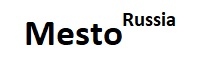

****
**[Проект: Место](https://aleksandr-hohlov.github.io/mesto/)**
### Проектная работа №3.

**Описание проекта:**

* вёрстка адаптивная: ширина зоны с содержимым меняется вместе с шириной окна браузера;
* реализовано с использованием JavaScript popup *редактирования профиля/добавления элемента на страницу/preview элемента*;
* реализовано с использованием JavaScript *открытие/закрытие/сохранение данных в профиле*;
* проектная работа опубликована на [gh-pages](https://aleksandr-hohlov.github.io/mesto/);
* при создании использованы grid-элементы;
* при создании использованы медиа запросы;
* при создании использованы template-элементы;
* файловая структура реализована по БЭМ;
* проект создан по макету Figma;

****
***[Ссылка на проект Mesto](https://aleksandr-hohlov.github.io/mesto/)***
****

